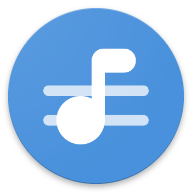

  
  <h1>Redomi</h1>
  
<a href="https://song.link/">Song.link</a> client made in Jetpack Compose and Material You

## Description

Don't you hate when your friend uses a different music platform than you (they always use the mid ones 👎👎👎) and you can't open it in your favourite app or viceversa????  
This app got you covered, you will be able to click on those links and see the song open in your favourite music streaming service!  
And you will also be able to share the song you want to anyone by converting the link to their prefered platform    
<b> All of this is done like it's integrated into your system! </b>

## Features

- Open supported links from different services into your favourite one
- Share song by converting it to different available services
- Customize Bottom Sheet in different ways:
  - Choose which apps you want to see and their order 
  - Decide between a horizontal or vertical list, and it's grid size
- Material You
- Light/Dark Theme

## Screenshots

  
  
  

  
  
  

## HOW TO MAKE IT WORK

By default Redomi can't open external links, to do so long press on the app's icon and open the info page,
from there open "Set/Open by default" (might be called a bit differently on some devices), and then check all the
music platforms *THAT ARE NOT INSTALLED*

## Supported services (+ 3rd party apps)

- Youtube music (+ Revanced, InnerTune, ViMusic)
- Youtube (+ Revanced, NewPipe, LibreTube)
- Spotify
- Deezer
- Tidal
- Amazon Music
- Apple Music
- Soundcloud
- Napster

## What still needs to be done?

- Reordering apps
- Vertical list needs to pin first row and then expand on scroll

Sometimes the song.link is slow to convert songs

## Credits

Obviously [Song.link](https://song.link/) or else it would have not been possible, and also [Ty3uK/songlink-android](https://github.com/Ty3uK/songlink-android) for giving me inspiration
